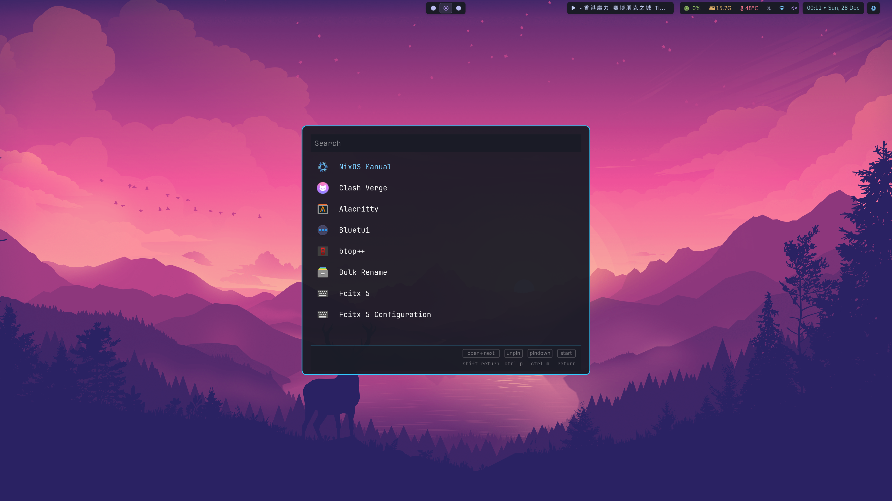
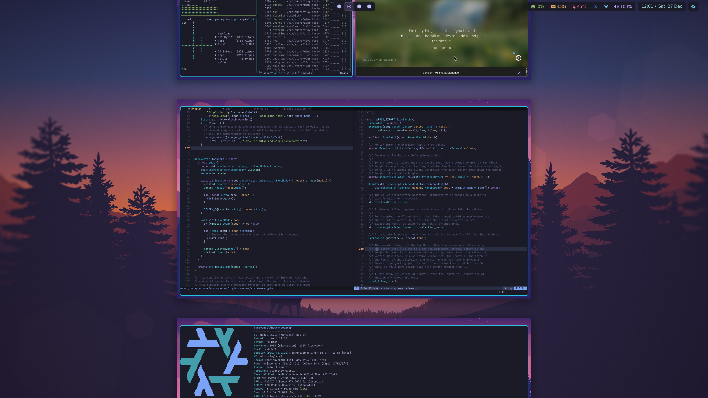

# nix-config

Personal Nix flake for my Linux desktops, standalone Home Manager hosts, and macOS via nix-darwin. It keeps system and home configuration in one place, driven by small feature flags and a Wayland-first Linux desktop stack.

[中文说明](./README.zh-CN.md)

## Screenshots



## Why Nix and NixOS

- Manage system, desktop, and development environments as code rather than ad‑hoc tweaks.
- Avoid “configuration black holes” by making everything reproducible and rebuildable from scratch.
- Gain a clean, predictable package management story and project‑local environments that are easy to recreate.

## Configuration philosophy

- Express all system and user configuration declaratively through Nix; avoid imperative one‑off commands.
- Prefer concentrating configuration and packages at the user level via Home Manager, so most of your setup can be reproduced even on non‑NixOS systems.
- Keep the base system small and uncluttered, without preinstalled language runtimes or heavy dev stacks.
- Use per‑project Nix dev shells, auto‑activated via `direnv`, as the primary way to provide development tooling.
- If a project has no dev shell, define one in a parent directory; fall back to containers for projects that are painful to model in Nix.
- Aim for configurations that are minimal, clean, and fully reproducible across machines.

## Desktop preferences

- Prefer a window manager over a full desktop environment to keep things simple and loosely coupled.
- Use a keyboard‑driven workflow with keybindings for most common actions.
- Make the terminal and an application launcher the core of the desktop experience.
- Avoid unnecessary applications; favor lightweight TUI tools over heavy GUI apps and use web apps where they make sense.
- Keep the bar minimal and focused, showing only information that matters in daily use; redundant items belong in the launcher, not on the bar.
- Concentrate bar elements toward the top‑right to stay out of the way and reduce visual noise.
- Treat aesthetics as “calm and coherent enough,” preferring simple, harmonious visuals over flashy themes.

## Repo layout
- `flake.nix`: Entrypoint using `flake-parts`, overlays, and a custom package set exposed internally as `pkgs.mypkgs.*` and externally as flat flake `packages.*` outputs.
- `hosts/`: Per-machine definitions combining system modules + home-manager modules and user metadata.
  - `nixos/`: NixOS system hosts (full system management).
  - `home/`: Standalone Home Manager hosts for machines without NixOS system-level control.
  - `darwin/`: macOS hosts managed with nix-darwin and Home Manager.
- `modules/`: Reusable building blocks
  - `system/`: NixOS and nix-darwin modules (desktop, peripherals, defaults, Homebrew, secure boot, graphics, etc.)
  - `home/`: Home Manager modules (shell, editor, terminal, Wayland/macOS apps, theming)
- `options/`: Custom feature flags (niri, walker, waybar, sunshine, nvidia, lanzaboote, etc.).
- `overlays/`: Overlays for pkgs.
- `pkgs/`: Custom packages and assets.

## Host profiles

### NixOS hosts (`nixosConfigurations`)
- `hasty-desktop`: Daily driver with NVIDIA, secure boot via lanzaboote, greetd + niri session, waybar, walker, Thunar, Sunshine for remote desktop.
- `vmware-desktop`: VM-oriented variant sharing the same Wayland stack (niri + walker + waybar + greetd + Thunar + Sunshine) without the NVIDIA/secure-boot bits.

### Standalone Home Manager hosts (`homeConfigurations`)
- `hasty-earningd`: Work dev server (non-NixOS). Manages only the user environment via standalone Home Manager.

### macOS hosts (`darwinConfigurations`)
- `hasty-mba`: MacBook setup using nix-darwin, Home Manager, nix-homebrew, Homebrew casks, macOS defaults, and Darwin-specific font/app modules.

## Desktop & user stack
- **WM/session**: Niri from `niri-flake`, Wayland-first environment variables baked in.
- **Greeter/session start**: greetd (SDDM optional toggle).
- **Bar & launcher**: Waybar with custom styling, Walker launcher.
- **Lock & idle**: swaylock; swayidle available via flag.
- **Input/IME**: fcitx5.
- **Notifications/OSD**: mako + avizo volume/brightness OSD.
- **Display rules**: kanshi for multi-monitor profiles.
- **File manager**: Thunar.
- **Remote desktop**: Sunshine toggle.
- **Theming**: Stylix plus curated wallpapers/icons in `pkgs/assets`.
- **CLI base**: zsh + starship, zellij, direnv, git defaults, fzf, custom packages consumed internally via `pkgs.mypkgs.*`.

## Neovim
Neovim is enabled via Home Manager and sources my external config (`inputs.nvim-config`, repo: [Hastyshell/diy.nvim](https://github.com/Hastyshell/diy.nvim)) directly into `~/.config/nvim`. Extra build/runtime deps are pre-wrapped (nixd, lua-language-server, stylua, nixfmt, statix, deadnix, rg, fzf, shellcheck/shfmt, sql/toml/yaml/markdown/Actions tooling) so LSPs, formatters, and Telescope work out of the box.

## Custom options
See `options/default.nix` for feature switches like `custom.linux.desktop.wm.niri.enable`, `custom.linux.desktop.bar.waybar.enable`, `custom.nixos.graphics.nvidia.enable`, `custom.nixos.secureBoot.lanzaboote.enable`, `custom.nixos.desktop.remoteDesktop.sunshine.enable`, etc. Hosts compose these to turn features on/off per machine.

## Using `nh`
Prereqs: flakes enabled, `nh` installed (e.g., `nix profile install nixpkgs#nh`). Run from the repo root:

```bash
# Switch a NixOS host
nh os switch . #hostname

# Dry-run/test a NixOS host
nh os test . #hostname

# Switch a standalone Home Manager host
nh home switch . #hostname
```

For new NixOS machines, clone the repo, pick/create a host under `hosts/nixos/`, adjust feature flags in `globalOptions`, then run `nh os switch` with the matching `.#hostname`.

For new standalone Home Manager machines (non-NixOS), create a host under `hosts/home/`, then run `nh home switch` with the matching `.#hostname`.

## macOS runbook

Run from the repo root:

```bash
cd /Users/hastyshell/Projects/nix-config
```

### First deployment

```bash
sudo -E -H nix --option connect-timeout 60 --option download-attempts 10 \
  --extra-experimental-features "nix-command flakes" \
  run .#darwin-rebuild -- switch --flake .#hasty-mba
```

### Rebuild after the first successful activation

```bash
sudo darwin-rebuild switch --flake .#hasty-mba
```

If `darwin-rebuild` is not available yet, use the first-deployment command again.

### First `/etc` takeover

If activation reports unexpected `/etc/bashrc` or `/etc/zshrc` files:

```bash
sudo mv /etc/zshrc /etc/zshrc.before-nix-darwin
sudo mv /etc/bashrc /etc/bashrc.before-nix-darwin
```

Then rerun the deployment command.

### Existing app conflicts

If Homebrew reports that `/Applications/*.app` already exists:

```bash
mv "/Applications/AppName.app" "$HOME/Desktop/AppName.app.before-nix"
```

Then rerun the deployment command.

### Temporary proxy

If GitHub/GitLab downloads time out or fail with `early EOF`:

```bash
export http_proxy=http://127.0.0.1:7890
export https_proxy=http://127.0.0.1:7890
export all_proxy=socks5://127.0.0.1:7890
export HTTP_PROXY=$http_proxy
export HTTPS_PROXY=$https_proxy
export ALL_PROXY=$all_proxy
export GIT_HTTP_VERSION=HTTP/1.1
```

Then rerun the first-deployment command.

### Prefetch flake inputs

If flake input downloads keep failing:

```bash
nix --option connect-timeout 60 --option download-attempts 10 \
  --extra-experimental-features "nix-command flakes" \
  flake archive .
```

Then rerun the deployment command.

### Verify config

```bash
nix --extra-experimental-features "nix-command flakes" \
  eval .#darwinConfigurations.hasty-mba.config.networking.hostName

nix --extra-experimental-features "nix-command flakes" \
  eval .#darwinConfigurations.hasty-mba.config.homebrew.casks --json

nix --extra-experimental-features "nix-command flakes" \
  eval .#darwinConfigurations.hasty-mba.config.fonts.packages --apply builtins.length
```

Notes:

- Use this repo's `.#darwin-rebuild`; do not run `sudo nix run github:nix-darwin/...` directly.
- Avoid `sudo launchctl setenv` for proxy setup; SIP can block it.
- Restart the terminal, log out/in, or reboot if shell integration, fonts, or macOS defaults do not appear immediately.

## Acknowledgements
- [ryan4yin/nix-config](https://github.com/ryan4yin/nix-config): many configurations were adapted from here.
- [niksingh710/ndots](https://github.com/niksingh710/ndots): the flake layout inspired how this repo is organized.
- [vimjoyer](https://github.com/vimjoyer): his YouTube videos taught me many core Nix concepts.
- [nix-community/lanzaboote](https://github.com/nix-community/lanzaboote): solved secure boot alongside Windows in my dual-boot setup.
- [hercules-ci/flake-parts](https://github.com/hercules-ci/flake-parts): helped structure my flake more like real software engineering.
- [sodiboo/niri-flake](https://github.com/sodiboo/niri-flake): made the Niri configuration straightforward and reproducible.
- [basecamp/omarchy](https://github.com/basecamp/omarchy): drew from its Linux desktop aesthetic and borrowed two favorite wallpapers.
